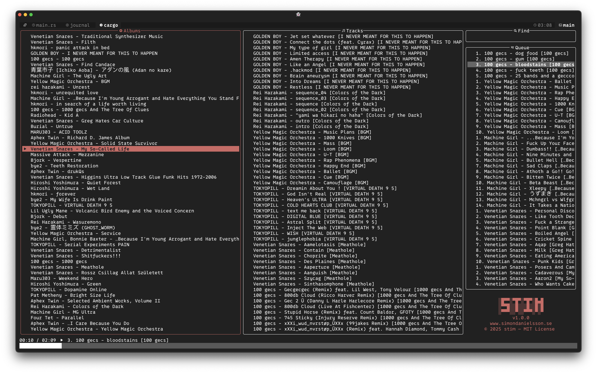

<p align="center">
    
</p>
  
<p align="center">
  <em>A TUI application built for listening to music without all<br>
        of the bloat and superfluous features.</em>
</p>
  
<p align="center">
  <a href="https://github.com/simon-danielsson/stim/releases/latest">
    
  </a>
  <a href="https://github.com/simon-danielsson/stim/blob/main/LICENSE">
    
  </a>
  
</p>
  


---
## ✨ Features
+ Find music quickly using the "find" feature.
+ Keybindings accommodate for both Qwerty and Workman layouts.
+ 

> [!IMPORTANT]  
> stim only supports **Unix** systems (and has so far only been tested on MacOS)  
  
---
## 💻 Installation (MacOS)
  
**1. Download the latest release of stim**  
``` bash
curl -L https://github.com/simon-danielsson/stim/releases/latest/download/stim -o ~/.local/bin/stim
```
  
**2. Make it executable**  
``` bash
chmod +x ~/.local/bin/stim
```
  
**3. Launch stim for the first time to create "stim-library" in your ~ folder**  
``` bash
stim
```
  
**4. Add all your music to the "stim-library" directory (be sure that the music files contain the necessary metadata)**

**5. Learn the controls and listen to some music!**

---
## 🚀 Controls
**Playback**  
  
```
[ = Decrease volume.
] = Increase volume.

{ = Go to the previous track in the queue.
} = Go to the next track in the queue.

[Space] = Play/pause current track.
```

**Queue**  
  
```
If inside the "Albums" or "Tracks" pane:
[a] = Add selected album/track to the back of the queue.
[A] = Add selected album/track to the front of the queue.

If inside the "Queue" pane: 
[a] = Remove selected track from the queue.
[A] = Move selected track to the front of the queue.

[Esc] = Clear the queue (note that the queue doubles as 
        the playback history, so clearing it will also clear your history).
```

**General**  
  
```
[q] = Quit the program.

[f] = Search the contents of all the panes at once. 

[F] = Clear search.

Not implemented yet:
[s] = Toggle sorting of the "Albums" and "Tracks" panes to A-Z or Z-A.

Not implemented yet:
[c] = Rotate between different accent colors for the UI.

You can navigate with both the Qwerty and Workman layouts, as well as with the arrow keys.
[h], [n], [Left]  = Navigate left.
[j], [e], [Down]  = Navigate down.
[k], [o], [Up]    = Navigate up.
[l], [i], [Right] = Navigate right.
```

---
## 🛠️ Built With
+ [crossterm](https://github.com/crossterm-rs/crossterm)  
+ [lofty](https://github.com/serial-ata/lofty-rs)  
+ [ratatui](https://github.com/ratatui/ratatui)  
+ [rodio](https://github.com/RustAudio/rodio)  
+ [walkdir](https://github.com/BurntSushi/walkdir)  

---
## 📜 License
This project is licensed under the [MIT License](https://github.com/simon-danielsson/stim/blob/main/LICENSE).  
